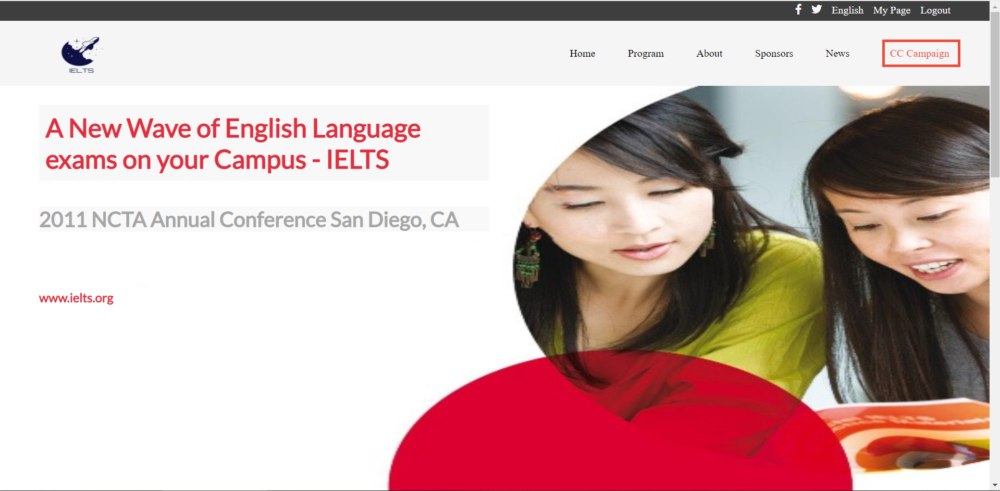
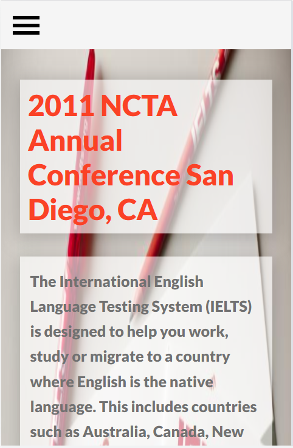
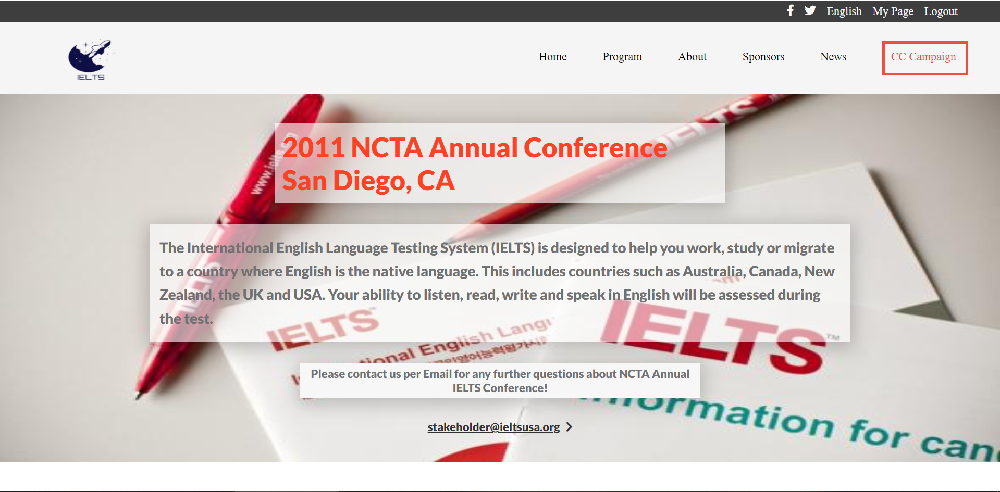

# First-Capstone-Project

2011 NCTA IELTS Annual Conference San Diego, CA

## Mobile version Home page | Desktop version Home page
 | 

## Mobile version About page | Desktop version About page
 | 

## Getting Started
To get a local copy up and running follow these simple example steps.
### Prerequisites
  * Knowledge on basic html css and javascript
  * Text Editor (VScode, Atom, Sublime text, etc)
  * Basic knowledge of node.js
  * Setup
  * Clone repository using git clone
  * Run npm install
  * Runlive server
## Built with :
 * HTML/CSS
 * Javascript
 * Linters
 * Fontawesome icons

 ## Authors
  [Github:](https://github.com/fed1k)
  [LinkedIn:](https://www.linkedin.com/in/firdavs-allamurotov-12b60a226/)

## Live version
[Live version](https://fed1k.github.io/First-Capstone-Project/)

## Original Designer
Cindy Shin(GUI and Graphic designer)
View original design(https://www.behance.net/gallery/29845175/CC-Global-Summit-2015)